# Diagrama — Flujo completo del Turnero

Árbol de decisión del portal de reserva de turno online (Módulo 1).
Cubre: clasificación de vehículo, Hard Stops, Matriz RTO, validaciones, documentación y facturación.

```mermaid
flowchart TB
    INICIO(["INICIO"]) --> PATENTE[/"Ingresar DOMINIO\npatente del vehículo"/]

    PATENTE --> CONSULTA{"¿El vehículo existe\nen el sistema RTO?"}

    CONSULTA -- SÍ --> ESTADO{"Estado de última revisión"}

    ESTADO -- "CONDICIONAL" --> PLAZO{"¿Pasaron más de\n30 días?"}
    PLAZO -- NO --> REVERIF["Turno directo\nReverificación"]
    PLAZO -- SÍ --> DERIVAR["⚠️ Derivar a operador\n(plazo vencido)"]

    ESTADO -- "APROBADA / SIN CONDICIÓN" --> CTA{"¿Cliente con\ncuenta corriente?"}

    CTA -- SÍ --> CTA_TURNO["💳 Mostrar estado de cuenta\ny asignar turno directo"]
    CTA -- NO --> DATOS["Se obtienen datos\ndel sistema RTO"]

    CONSULTA -- NO --> MANUAL[/"Solicitar datos\nmanualmente"/]

    %% =========================
    %% CLASIFICACIÓN
    %% =========================

    DATOS --> TIPO{"¿Categoría y tipo\n(según cédula)?"}
    MANUAL --> TIPO

    TIPO -- "N1 - Sedán / Auto / SUV" --> UP_PROV{"¿Provincia de radicación?"}

    UP_PROV -- "Bs As / Mendoza / CABA" --> UP_NO_VERIF["⛔ No verificamos este vehículo\nDebe realizar la RTO en su jurisdicción"]

    UP_PROV -- "Otra provincia" --> UP_DIRECTO["Tipo = USO PARTICULAR"]

    %% =========================
    %% N1 PICKUP
    %% =========================

    TIPO -- "N1 - Pick-up\n(hasta 3.500 kg)" --> N1_PROV{"¿Provincia de radicación?"}

    N1_PROV -- Bs As / Mendoza / CABA --> N1_CARGA["Tipo = CARGA\nobligatoriamente"]
    N1_PROV -- Otra provincia --> N1_ELIGE{"¿Uso particular\no carga?"}

    N1_ELIGE -- Uso particular --> FLUJO_UP["Tipo = USO PARTICULAR"]
    N1_ELIGE -- Carga --> FLUJO_CARGA_N1["Tipo = CARGA"]

    %% =========================
    %% CARGA
    %% =========================

    TIPO -- N2 / N3 --> CARGA_DIRECTO["Tipo = CARGA"]

    N1_CARGA --> CARGA_PELIGROSA{"¿Transporta\ncarga peligrosa?"}
    CARGA_DIRECTO --> CARGA_PELIGROSA
    FLUJO_CARGA_N1 --> CARGA_PELIGROSA

    CARGA_PELIGROSA -- SÍ --> CP_ANT{"¿Antigüedad\ndel vehículo?"}
    CARGA_PELIGROSA -- NO --> VALIDACIONES

    CP_ANT -- Hasta 10 años --> CP_12["RTO cada 1 año"]
    CP_ANT -- Más de 10 años --> CP_4["RTO cada 4 meses"]

    CP_4 --> ALERTA_CP["⚠️ Aviso: si aprueba,\nvalidez será de 4 meses"]

    CP_12 --> VALIDACIONES
    ALERTA_CP --> VALIDACIONES

    %% =========================
    %% USO PARTICULAR
    %% =========================

    UP_DIRECTO --> UP_ANT{"¿Antigüedad?"}
    FLUJO_UP --> UP_ANT

    UP_ANT -- Menos de 7 años --> UP_2["RTO cada 2 años"]
    UP_ANT -- 7 años o más --> UP_1["RTO cada 1 año"]

    UP_2 --> VALIDACIONES
    UP_1 --> VALIDACIONES

    %% =========================
    %% PASAJEROS
    %% =========================

    TIPO -- M1 / M2 / M3 --> PASAJEROS["PASAJEROS"]

    PASAJEROS --> P_ANT{"¿Antigüedad\n> 13 años?"}
    P_ANT -- SÍ --> P_NOAPTO_ANT["⛔ NO puede\nprestar servicio"]
    P_ANT -- NO --> P_TACO{"¿Tiene tacógrafo?"}

    P_TACO -- NO --> P_NOAPTO_TACO["⛔ Tacógrafo\nobligatorio"]
    P_TACO -- SÍ --> P_CEDULA{"¿La cédula indica\ntransporte de pasajeros?"}

    P_CEDULA -- NO --> P_NOAPTO_CED["⛔ La cédula debe\nindicar uso pasajeros"]
    P_CEDULA -- SÍ --> P_0KM{"¿Es 0 km?"}

    P_0KM -- SÍ --> P_RTO_INICIAL["Debe hacer RTO\ndesde 0 km"]
    P_0KM -- NO --> P_FREQ{"¿Antigüedad?"}

    P_RTO_INICIAL --> P_FREQ

    P_FREQ -- Hasta 10 años --> P_6["RTO cada 6 meses"]
    P_FREQ -- Más de 10 años --> P_4["RTO cada 4 meses"]

    P_4 --> ALERTA_P["⚠️ Aviso: si aprueba,\nvalidez será de 4 meses"]

    P_6 --> VALIDACIONES
    ALERTA_P --> VALIDACIONES

    %% =========================
    %% VALIDACIONES
    %% =========================

    VALIDACIONES{"¿Vidrios delanteros\npolarizados?"}

    VALIDACIONES -- SÍ --> V_ADVERTENCIA["⚠️ Debe retirar polarizado\nsino no resultará apto"]
    VALIDACIONES -- NO --> BANDAS_CHECK{"¿Aplica bandas?"}

    V_ADVERTENCIA --> BANDAS_CHECK

    BANDAS_CHECK -- NO (UP) --> DOCUMENTACION
    BANDAS_CHECK -- SÍ --> BANDAS{"¿Tiene bandas\nreflectivas?"}

    BANDAS -- NO --> B_OBS["⚠️ Puede ser observado"]
    BANDAS -- SÍ --> DOCUMENTACION

    B_OBS --> DOCUMENTACION

    %% =========================
    %% DOCUMENTACIÓN
    %% =========================

    DOCUMENTACION{"¿Tiene cédula\ntarjeta verde?"}

    DOCUMENTACION -- NO --> D_NOAPTO["⛔ No puede realizar\nla revisión"]
    DOCUMENTACION -- SÍ --> RTO_ANT{"¿Tiene RTO anterior?"}

    RTO_ANT -- SÍ --> RTO_PRES["Debe presentarlo"]
    RTO_ANT -- NO --> FACTURACION

    RTO_PRES --> FACTURACION

    %% =========================
    %% FACTURACIÓN
    %% =========================

    FACTURACION["Mostrar TITULAR"] --> FACT_PREG{"¿Factura a titular?"}

    FACT_PREG -- SÍ --> FACT_TIT["Factura al TITULAR"]
    FACT_PREG -- NO --> FACT_OP[/"Solicitar CUIT y datos"/]

    FACT_TIT --> RESUMEN(["FIN"])
    FACT_OP --> RESUMEN

    %% =========================
    %% ESTILOS
    %% =========================

    classDef noapto fill:#e74c3c,color:#fff
    classDef obs fill:#f39c12,color:#000
```

